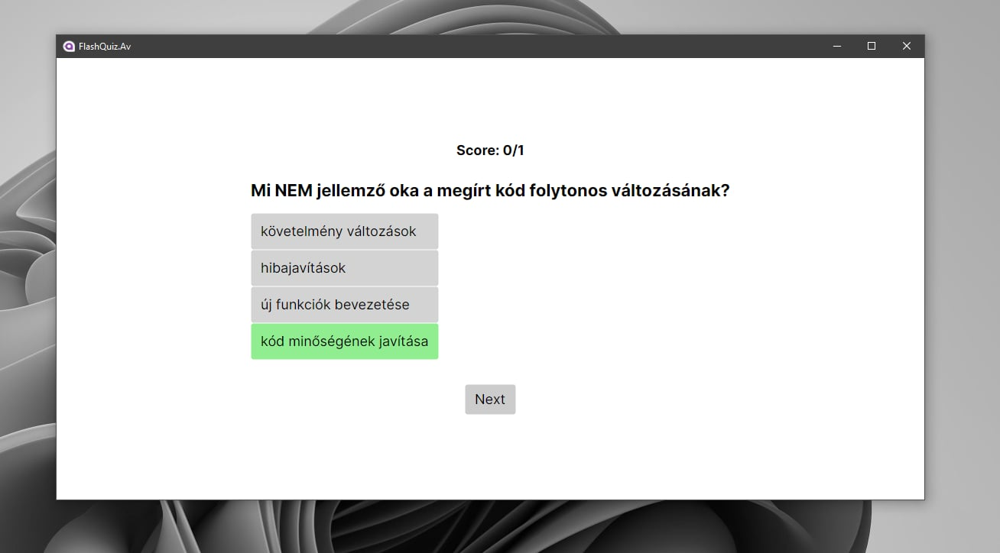

# FlashQuiz

FlashQuiz is a simple quiz application for practicing questions and answers from a file. The repository contains **two separate projects**:

---

## Projects Overview

### 1. FlashQuiz (Console)

- **Type:** Console application
- **Description:**  
  A command-line tool where you can load questions from a file, answer them interactively, and the program keeps track of your score.
- **Key Features:**
  - Load questions from a file
  - Answer questions via the console
  - Score tracking
- **Project Path:** `FlashQuiz/`

---

### 2. FlashQuiz2 (GUI with Avalonia UI)

- **Type:** GUI application (cross-platform (Android and Windows), Avalonia UI)
- **Description:**  
  A graphical version of FlashQuiz. It provides a user-friendly interface for loading questions, answering them, and viewing your score.
- **Key Features:**
  - Load questions from a file
  - Intuitive graphical interface (Avalonia UI)
  - Real-time scoring
- **Project Path:** `FlashQuiz2/`

---

## How To Use

### Running the Console Version

1. Navigate to the `FlashQuiz` directory.
2. Build and run the application using your preferred .NET toolchain.
3. Follow the on-screen prompts to load a question file and start answering.

### Running the GUI Version

1. Navigate to the `FlashQuiz2` directory.
2. Build and run the application.
3. Use the graphical interface to load your question file and answer questions.

---

## Screenshots

### FlashQuiz

### FlashQuiz2 (GUI)

You can find more screenshots at [here](Documentation/Screenschots)

---

## Question File Format

Questions must be provided in a specific file format. Please refer to the documentation inside each project for sample files and format details.

---

## Requirements

- .NET SDK (for building and running)
- Avalonia UI dependencies (for FlashQuiz2 GUI version)

---

## License

This project is licensed under the MIT License.

---

## Contributing

Feel free to open issues or submit pull requests if you'd like to contribute or suggest improvements.
